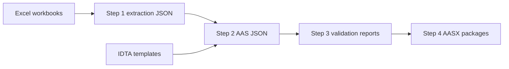

# excel-to-aasx

Excel-to-AASX generator for supplier workbook data.

The package reads configured `.xlsx` workbooks, preserves a neutral extraction
record, maps workbook rows into selected IDTA/Admin Shell submodel templates,
validates the generated AAS JSON, and writes AASX packages with review reports.

## Pipeline



## Inputs

```text
configs/companies/<company>.json
configs/formats/<format>.json
data/input/<company>/*.xlsx
third_party/admin-shell-io/submodel-templates
third_party/aas-core-works/aas-core-codegen
third_party/aas-core-works/aas-core3.0-python
```

## Outputs

```text
data/generated/<company>/xlsx-json-step1/
data/generated/<company>/xlsx-json-step2/
data/generated/<company>/xlsx-json-step3/
data/generated/<company>/xlsx-json-step4/
data/generated/<company>/aasx/
data/generated/<company>/logs/
```

Important review files:

```text
mapping-report.json
validation-report.json
review/<sheet>/unmapped-rows.json
review/<sheet>/preclassified-unmapped-rows.json
review/<sheet>/dummy-generated.json
review/<sheet>/matched-rows.json
summary.json
aasx/*.aasx
```

In Step 2 logs, `preclassified_unmapped_excel_row` is diagnostic only: the
first generic classifier did not directly place the row. `unresolved_excel_row`
is the important value: it counts rows still not placed after the full
transform. Review `unmapped-rows.json` for actual unresolved source data.

## Setup

```bash
git submodule update --init --recursive
python3 -m venv .venv
. .venv/bin/activate
pip install -e .[dev]
```

## Run

Extract Excel data only:

```bash
make extract COMPANY=schunk
```

Run the full pipeline:

```bash
make generate COMPANY=schunk
```

Run tests:

```bash
python -m pytest tests
```

## Documentation

```text
docs/README.md
docs/architecture.md
docs/quickstart.md
docs/third-party.md
docs/limitations.md
```

Start with `docs/architecture.md` for the data flow and
`docs/limitations.md` before treating generated output as reviewed product
data.
