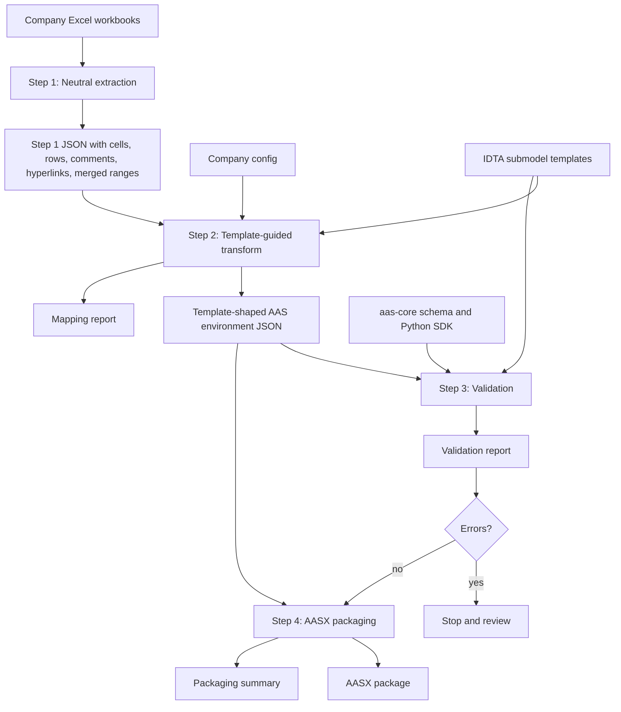
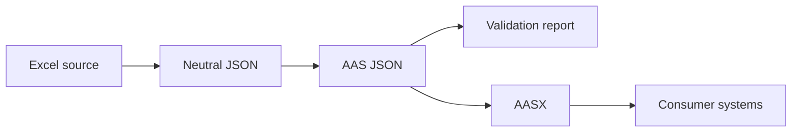

# Architecture

`excel-to-aasx` converts semi-structured supplier Excel workbooks into
auditable AAS JSON and AASX packages.

## Pipeline



## Stage Responsibilities

| Stage | Output | Responsibility |
| --- | --- | --- |
| Step 1 extraction | `xlsx-json-step1/` | Capture workbook content as reviewable neutral JSON |
| Step 2 transform | `xlsx-json-step2/` | Deep-copy official templates and fill values from extracted rows |
| Step 3 validation | `xlsx-json-step3/` | Check AAS schema, SDK verification, template shape, project rules |
| Step 4 package | `xlsx-json-step4/`, `aasx/` | Write package-ready JSON and AASX, roundtrip-read it, and publish flat AASX copies |

## Artifact Flow



## Configuration Model

Configuration is split into two layers:

```text
configs/formats/<format>.json
  reusable workbook layout and sheet-to-template mapping

configs/companies/<company>.json
  exact input directory, workbook list, output root, and asset identifiers
```

Company configs use `extends` to inherit the repeated format mapping:

```json
{
  "extends": "../formats/idta-schunk-workbook.json",
  "company": "schunk",
  "inputDir": "data/input/schunk",
  "outputRoot": "data/generated/schunk",
  "workbooks": ["EGP 40-N-N-B.xlsx"]
}
```

Format configs select:

- worksheet names;
- target `submodelIdShort` values;
- official IDTA/Admin Shell template files;
- generation policy defaults for that workbook format.

Company configs select:

- input workbook directory;
- expected workbook names;
- output root;
- AAS, asset, and submodel identifier prefixes.

This keeps per-product configs small while still allowing the workbook format
to change independently when the Excel layout changes.

## Generation Policy

`generationPolicy` controls transformation behavior that cannot be decided from
the AAS standard alone:

```json
{
  "generationPolicy": {
    "emptyActualValue": "skip",
    "mandatoryMissingValue": "dummy",
    "optionalEmptyTemplateBranches": "prune",
    "reviewFiles": "always",
    "logLevel": "normal"
  }
}
```

Supported values:

| Key | Values | Effect |
| --- | --- | --- |
| `emptyActualValue` | `skip`, `preserve-empty`, `dummy` | Controls non-mandatory Excel rows where `Actual Value` is blank |
| `mandatoryMissingValue` | `error`, `dummy`, `preserve-empty` | Controls mandatory template leaves without source values |
| `optionalEmptyTemplateBranches` | `prune`, `keep-empty`, `dummy` | Controls optional template branches with no mapped source data |
| `reviewFiles` | `always`, `issues-only`, `off` | Controls per-sheet review JSON files |
| `logLevel` | `quiet`, `normal`, `detailed` | Controls transform summary logging |

The default keeps blank non-mandatory rows out of standard template branches.
This avoids creating optional branches only because the supplier workbook copied
template placeholders without actual values. Users who need blank Excel rows to
remain visible can set `emptyActualValue` to `preserve-empty` or `dummy` and
review the resulting AAS carefully.

## Evidence Model

The generator must never silently drop uncertainty. Review evidence is written
at each stage:

```text
xlsx-json-step1/
  complete workbook extraction

xlsx-json-step2/
  environment.json
  mapping-report.json
  review/<sheet>/*.json

xlsx-json-step3/
  validation-report.json

xlsx-json-step4/
  environment.json
  *.aasx
  summary.json

aasx/
  *.aasx
  summary.json

logs/
  timestamped stage logs
  latest log per stage
```

Mapping and validation reports are part of the engineering output. They are how
a reviewer checks which rows were matched, skipped, expanded, or converted into
dummy values.

## Step 2 Review Files

Step 2 writes both a complete `mapping-report.json` and smaller per-sheet
review files:

| File | Meaning |
| --- | --- |
| `unmapped-rows.json` | Rows still unresolved after the full transform |
| `preclassified-unmapped-rows.json` | Rows the first generic classifier could not directly place |
| `matched-rows.json` | Rows placed into the generated AAS JSON |
| `dummy-generated.json` | Mandatory template values filled by policy |
| `skipped-template-scaffold.json` | Excel rows treated as template structure, not product data |
| `optional-pruned.json` | Empty optional template branches removed before output |

The terminal summary uses the same distinction:

```text
preclassified_unmapped_excel_row=2, unresolved_excel_row=0
```

`preclassified_unmapped_excel_row` is diagnostic. It can include rows that were
successfully mapped later, for example list entries handled by specialized
transform logic. `unresolved_excel_row` is the final unresolved count and should
match `review/<sheet>/unmapped-rows.json`.
