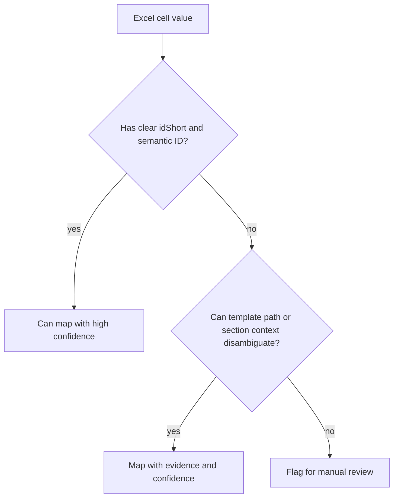

# Limitations

This project makes Excel-to-AASX generation reproducible and reviewable. It
does not make arbitrary spreadsheets semantically correct AAS instances.

## Strong Guarantees

The pipeline can guarantee:

- workbook content is extracted into stable JSON evidence;
- configured official templates are used as the structural source;
- generated AAS JSON is checked by schema and SDK validation;
- project rules reject known bad outputs such as parser metadata leakage;
- AASX packages are roundtrip-read before success is reported;
- mapping, validation, dummy-value, and packaging decisions are logged.

## Weak Guarantees

The pipeline cannot fully guarantee:

- every Excel row belongs to the chosen submodel;
- every visual section heading was interpreted correctly;
- every unit, value, file, image, and lifecycle field is business-correct;
- copied template rows in Excel represent real product data;
- a missing value should be empty, dummy-generated, or manually supplied;
- a UI visualization tab will render every valid AAS element.

## Why Full Automation Is Limited

Excel contains layout and presentation signals, not a formal AAS mapping. A
merged cell, color, blank row, or nearby heading can be meaningful to a human
while still being ambiguous to software.



## Dummy Values

Mandatory fields are derived from the selected IDTA template, not from the
Excel sheet title or visual layout. In the current implementation, a leaf
element is treated as mandatory when the template contains:

```text
qualifiers[].type = SMT/Cardinality
qualifiers[].value = One
```

Dummy generation currently applies only to these leaf element types:

| AAS element type | Missing value behavior |
| --- | --- |
| `Property` | Fill `value` according to `valueType` |
| `MultiLanguageProperty` | Fill English text with `Not Available` |
| `File` | Fill `/dummy/not-available.txt` and default `contentType` if needed |
| `Range` | Fill both `min` and `max` |

Container elements such as `SubmodelElementCollection` and
`SubmodelElementList` are not dummy-filled directly. Their children are checked
recursively.

Dummy values used by type:

| `valueType` | Dummy value |
| --- | --- |
| `xs:string` and unknown types | `Not Available` |
| `xs:boolean` | `false` |
| integer types | `-1` |
| decimal/float/double types | `-1.0` |
| `xs:date` | `1970-01-01` |
| `xs:dateTime` | `1970-01-01T00:00:00` |
| `xs:anyURI` | `https://example.org/dummy/not-available` |

The purpose is visibility and structural completeness. If the template says a
field is mandatory but Excel provides no value, the default policy generates a
typed placeholder and records the decision.

Dummy values are marked with:

```text
SourceValueStatus = DummyGenerated
```

Dummy-generated rows are also listed in `mapping-report.json` under:

```text
submodels[].dummyGeneratedRows
```

This is not real product data. It is a review signal.

`generationPolicy.mandatoryMissingValue` controls this behavior:

| Value | Behavior |
| --- | --- |
| `dummy` | Generate a typed placeholder and continue |
| `error` | Fail generation when a mandatory value is absent |
| `preserve-empty` | Keep an empty value and mark `MissingInExcel` |

## Missing Excel Values

Some Excel rows describe a parameter but have no `Actual Value`. Handling is
policy-controlled because both choices are valid in different review workflows:

| `generationPolicy.emptyActualValue` | Behavior |
| --- | --- |
| `skip` | Do not instantiate non-mandatory blank standard-template rows |
| `preserve-empty` | Instantiate safely matched rows with an empty value |
| `dummy` | Instantiate safely matched rows with a typed dummy value |

The default is `skip`. It prevents copied optional template branches from
creating noisy AAS elements only because the workbook contains blank template
rows. Users who need blank Excel rows to remain visible can set
`emptyActualValue` to `preserve-empty` or `dummy` and review the result.

Such elements are marked with:

```text
SourceValueStatus = MissingInExcel
```

This distinction matters:

| Status | Meaning |
| --- | --- |
| `MissingInExcel` | Excel mentioned the element, but did not provide an actual value |
| `DummyGenerated` | The template required a value, so the pipeline inserted a typed placeholder |

## Supplementary Files

If Excel references a local image or PDF but the real file is not available,
the package step may add a placeholder supplementary file. This keeps AASX
packaging technically valid, but the placeholder is not a substitute for the
real document.

## Production Requirement

For production use, treat the generated reports as mandatory review artifacts.
High-confidence automation is acceptable only when:

- input workbook formats are controlled;
- template versions are pinned;
- mapping reports are reviewed;
- validation is clean;
- unresolved or low-confidence rows block release;
- accepted mappings become versioned configuration or tests.
