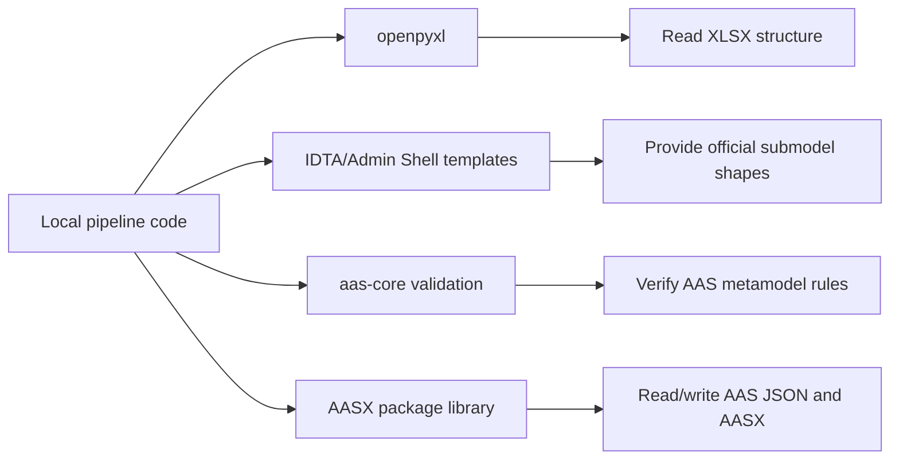

# Third-Party Dependencies

The generator uses a small set of external libraries and reference repositories
for workbook reading, template structure, AAS validation, and AASX packaging.

## Why Third-Party Code Is Needed



These dependencies keep the local code focused on extraction, mapping, and
evidence generation.

## Python Dependencies

| Dependency | Role |
| --- | --- |
| `openpyxl` | Reads XLSX workbooks, cells, formulas, comments, hyperlinks, merged ranges |
| `jsonschema` | Runs JSON Schema validation for generated AAS environments |
| `basyx-python-sdk` | Reads/writes AAS JSON and packages AASX files |
| `PyYAML` | Reserved for mapping/config formats if YAML mappings are introduced |
| `pytest` | Test runner for this package |

## Git Submodules

| Submodule | Role |
| --- | --- |
| `third_party/admin-shell-io/submodel-templates` | Official IDTA/Admin Shell submodel templates used as structure references |
| `third_party/aas-core-works/aas-core-codegen` | Generated AAS JSON Schema source used for schema validation |
| `third_party/aas-core-works/aas-core3.0-python` | Typed AAS V3.0 model deserialization and verification |

## Local Ownership

Project-specific behavior belongs in:

```text
configs/
excel_to_aasx/
tests/
docs/
```

Submodule contents are treated as reference inputs. Local adapters should stay
outside `third_party/`.
