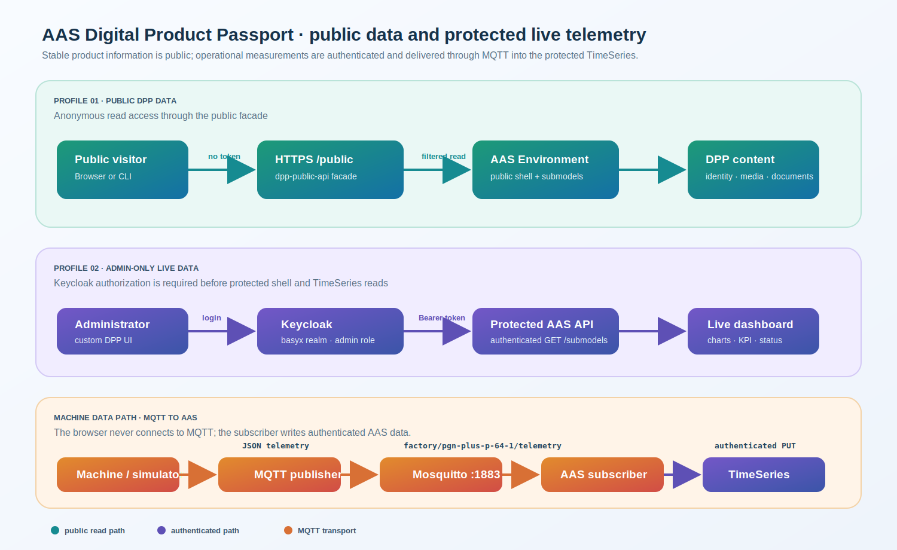

# Public DPP Data and Admin-Only Live Telemetry



This document describes the two access profiles used by the AAS demonstration
server and the MQTT path that feeds protected live telemetry.

## 1. Two data profiles

The server separates stable product information from operational machine data.

| Profile | Audience | Data | Authentication |
| --- | --- | --- | --- |
| Public DPP | Everyone | Shell identity, nameplate, technical data, carbon footprint, maintenance, handover documents and public media | None |
| Protected live data | Administrators only | TimeSeries telemetry and operational measurements | Keycloak login and `admin` realm role |

The public profile is provided by `dpp-public-api`. It reads the AAS
Environment internally using its service credential, filters private submodels,
and exposes only the remaining read-only data under `/public`.

The browser does not send a user token for public data. Another device can
therefore read the public DPP endpoints directly without logging in.

The protected profile is served by the normal AAS Environment endpoints. The
custom UI obtains a Keycloak token only after the user selects `Admin login`.
The token is sent in the `Authorization: Bearer ...` header for protected
shell/submodel reads.

## 2. Asset-specific live status

After administrator authentication, the UI reads each AAS shell through the
authenticated API and checks its submodel references for the private patterns:

```text
timeseries, telemetry, live
```

The current demonstration contains two assets:

| Asset | Public data | Protected live data |
| --- | --- | --- |
| `PGN-plus-P 64-1` | Yes | Yes; references the TimeSeries submodel |
| `EGU 50-IL-M-B` | Yes | No |

The green `LIVE` badge is hidden from anonymous visitors. After an admin login,
it appears only beside the asset whose authenticated shell contains a matching
private live submodel. Selecting the static asset shows its public passport but
does not start telemetry polling.

## 3. MQTT telemetry flow

MQTT is used for machine-side transport. The browser is not an MQTT client.

1. A machine, PLC adapter, or simulator creates a JSON measurement payload.
2. `mqtt-publisher` publishes it to the MQTT broker.
3. Mosquitto receives the message on TCP port `1883`.
4. `mqtt-aas-subscriber` subscribes to the topic and receives the payload.
5. The subscriber obtains an internal Keycloak service token.
6. It reads the protected TimeSeries submodel from the AAS Environment.
7. It updates the current record with an authenticated `PUT` request.
8. An administrator’s browser polls the protected AAS endpoint every two
   seconds and renders the changing values and charts.

The current topic is:

```text
factory/pgn-plus-p-64-1/telemetry
```

Example payload:

```json
{
  "time": 42,
  "jawPosition": 31.4,
  "gripForce": 52.8,
  "temperature": 25.1,
  "motorCurrent": 1.2,
  "cycleCount": 8,
  "state": "GRIPPING"
}
```

| MQTT field | AAS element |
| --- | --- |
| `time` | `Time` |
| `jawPosition` | `JawPosition` |
| `gripForce` | `GripForce` |
| `temperature` | `Temperature` |
| `motorCurrent` | `MotorCurrent` |
| `cycleCount` | `CycleCount` |
| `state` | `CurrentState` |

## 4. Starting the demonstration

```bash
docker compose --profile simulation up -d mqtt-broker mqtt-publisher
docker compose up -d mqtt-aas-subscriber
docker compose logs -f mqtt-aas-subscriber
```

The subscriber should report:

```text
Subscribed to factory/pgn-plus-p-64-1/telemetry
Updated AAS from factory/pgn-plus-p-64-1/telemetry
```

For a one-message test:

```bash
mosquitto_pub -h <AAS_SERVER_IP> \
  -t factory/pgn-plus-p-64-1/telemetry \
  -m '{"jawPosition":20,"gripForce":35,"temperature":25,"motorCurrent":1.2,"cycleCount":4,"state":"GRIPPING"}'
```

Then open the custom UI, log in as an administrator, select `PGN-plus-P 64-1`,
and inspect the live dashboard.

## 5. Security boundary

- MQTT transports measurements between trusted machine-side services.
- The subscriber authenticates before writing to the AAS TimeSeries.
- The public facade never exposes the protected TimeSeries.
- The browser reads telemetry only with an administrator token.
- The browser never connects directly to MQTT.

The development Mosquitto configuration permits anonymous connections for a
trusted LAN demonstration. Before exposing port `1883` outside that network,
configure MQTT users, password authentication, TLS, topic ACLs, and firewall
restrictions.

## 6. Useful endpoints

```text
Custom UI                 https://<server-ip>/
Public shell descriptors  https://<server-ip>/public/shell-descriptors
Public submodels          https://<server-ip>/public/submodels
Protected shells          https://<server-ip>/shells/<base64url-id>
Protected submodels       https://<server-ip>/submodels/<base64url-id>
Keycloak                  https://<server-ip>/auth/
MQTT broker               <server-ip>:1883
```

